# Интенсив Java от YLab (март 2023)

## Оглавление

1. [Задания к занятию 01 (Основы Java)](#задания-к-занятию-01-основы-java)
2. [Задания к занятию 02 (ООП)](#задания-к-занятию-02-ооп)
3. [Задания к занятию 03 (Коллекции и работа с файлами)](#задания-к-занятию-03-коллекции-и-работа-с-файлами)
4. [Задания к занятию 04 (PostgreSQL & RabbitMQ)](#задания-к-занятию-04-postgresql--rabbitmq)
5. [Задания к занятию 05 (Основы Spring)](#задания-к-занятию-05-основы-spring)

## Задания к занятию 01 (Основы Java)
[Вернуться](#оглавление)

1. **[Stars](./src/main/java/io/ylab/intensive/lesson01/Stars.java)**

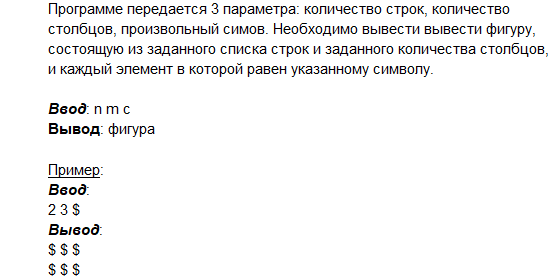

2. **[Pell](./src/main/java/io/ylab/intensive/lesson01/Pell.java)** ([Pell numbers](https://oeis.org/search?q=Pell+numbers))

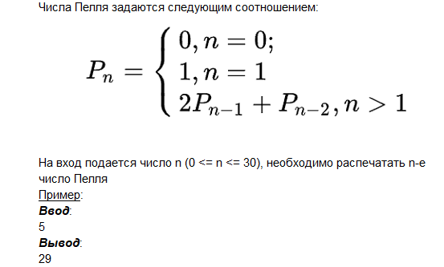

3. **[MultTable](./src/main/java/io/ylab/intensive/lesson01/MultTable.java)**

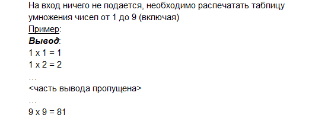

4. **[Guess](./src/main/java/io/ylab/intensive/lesson01/Guess.java)**

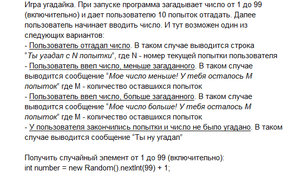

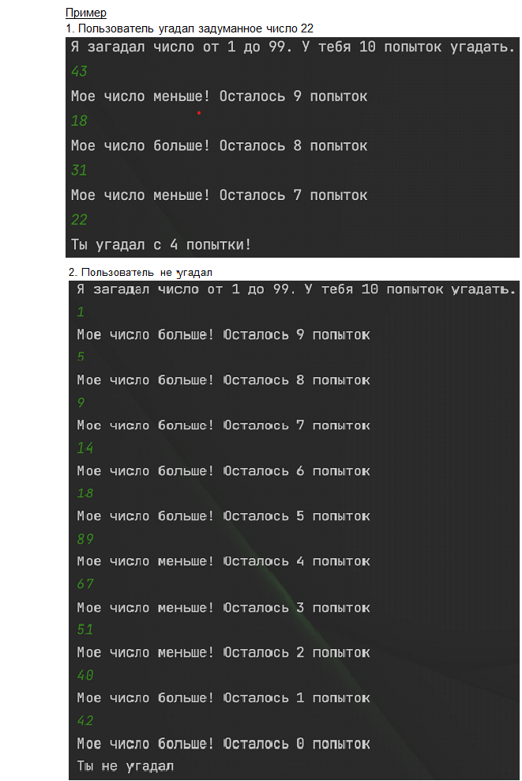

## Задания к занятию 02 (ООП)
[Вернуться](#оглавление)

1. **[Sequences](./src/main/java/io/ylab/intensive/lesson02/sequences)**

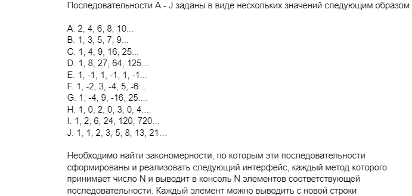

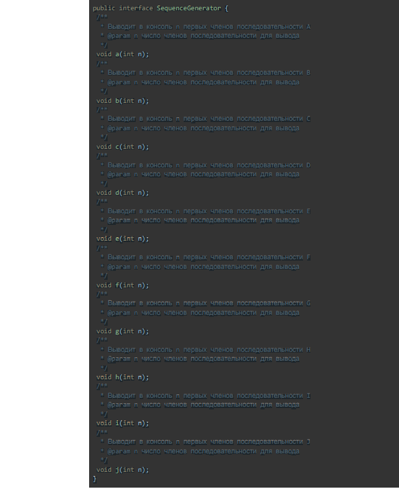

2. **[Complex Numbers](./src/main/java/io/ylab/intensive/lesson02/complex/numbers)**

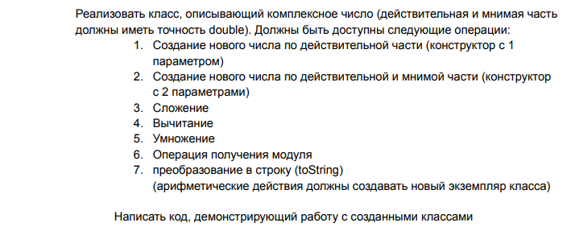

3. **[RateLimitedPrinter](./src/main/java/io/ylab/intensive/lesson02/rate/limited/printer)**

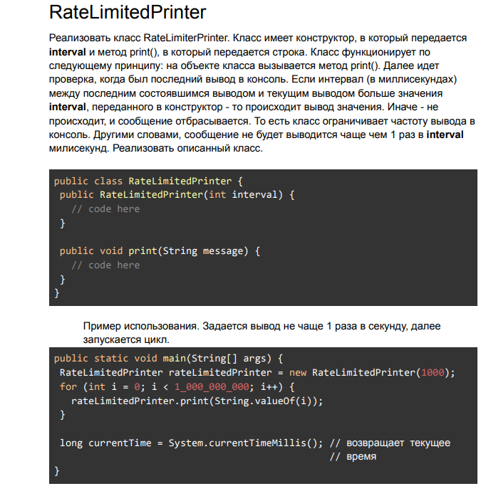

4. **[Snils Validator](./src/main/java/io/ylab/intensive/lesson02/snils/validator)**

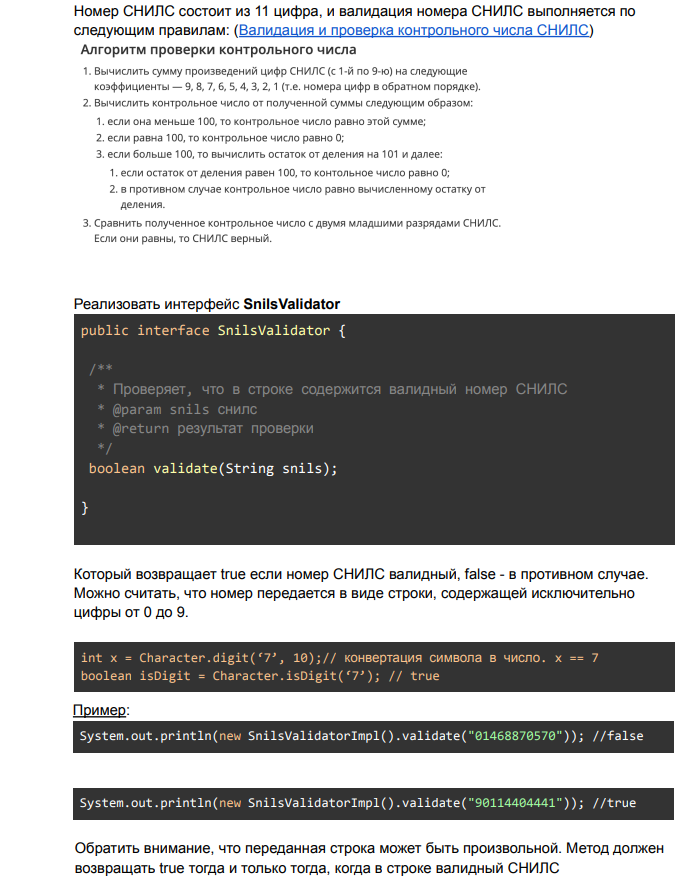

5. **[StatsAccumulator](./src/main/java/io/ylab/intensive/lesson02/stats/accumulator)**

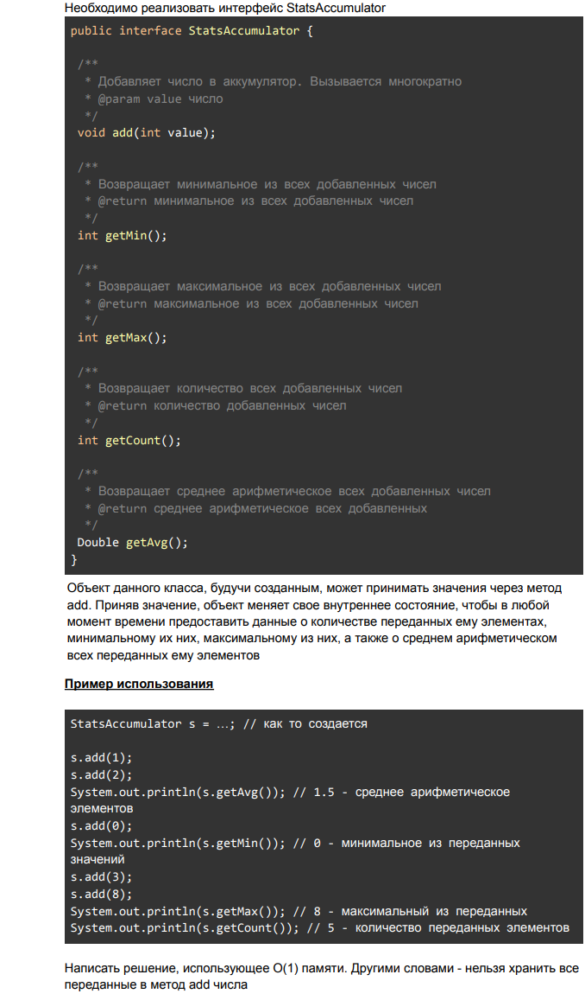

## Задания к занятию 03 (Коллекции и работа с файлами)
[Вернуться](#оглавление)

1. **[Transliterator](./src/main/java/io/ylab/intensive/lesson03/transliterator)**

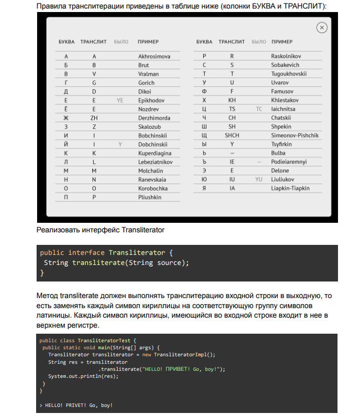

2. **[DatedMap](./src/main/java/io/ylab/intensive/lesson03/dated/map)**

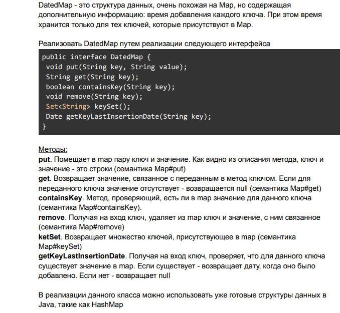

3. **[Org Structure](./src/main/java/io/ylab/intensive/lesson03/org/structure)**

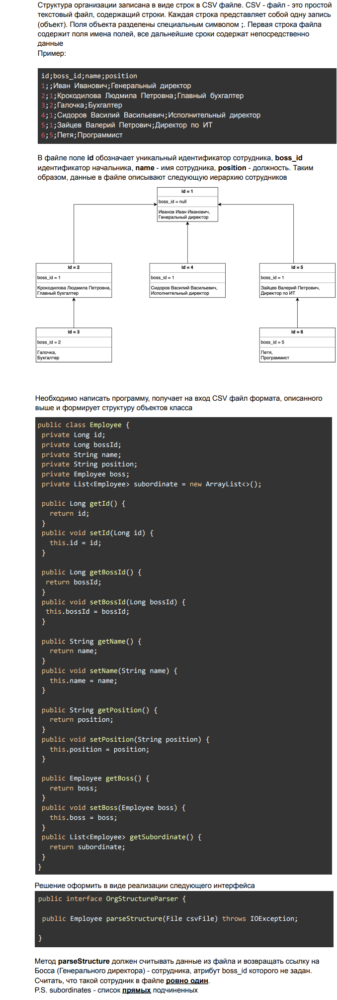

4. **[PasswordValidator](./src/main/java/io/ylab/intensive/lesson03/password/validator)**
    > https://www.examclouds.com/ru/java/java-core-russian/lesson17-tasks

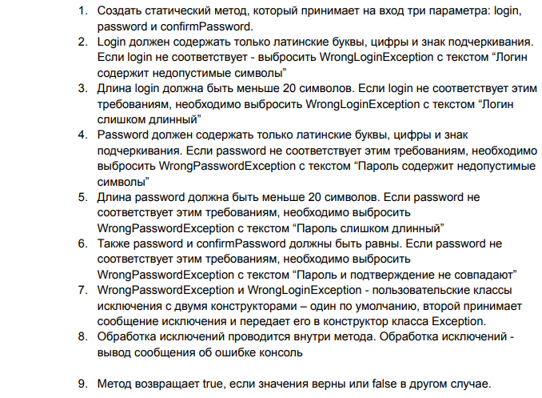

5. **[FileSort](./src/main/java/io/ylab/intensive/lesson03/file/sort)**

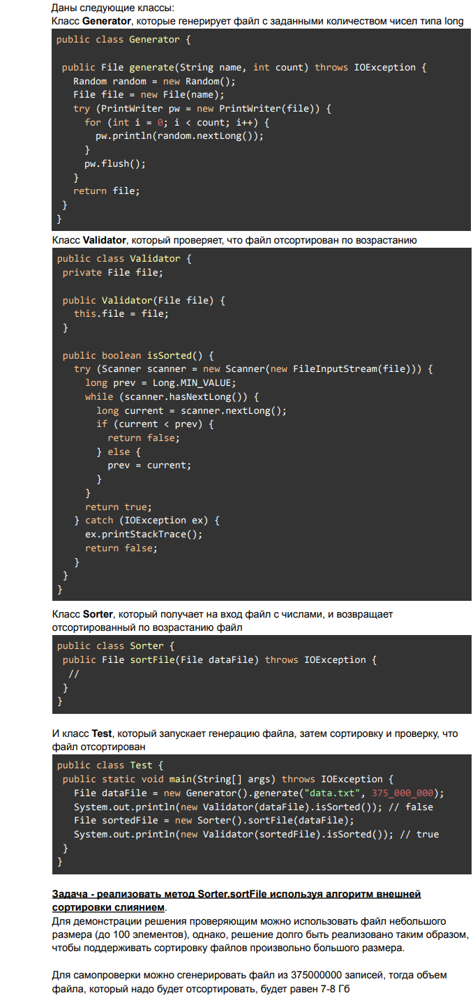

## Задания к занятию 04 (PostgreSQL & RabbitMQ)
[Вернуться](#оглавление)

1. **[Movie Database](./src/main/java/io/ylab/intensive/lesson04/movie)**
   > Скачать файл https://perso.telecom-paristech.fr/eagan/class/igr204/data/film.csv

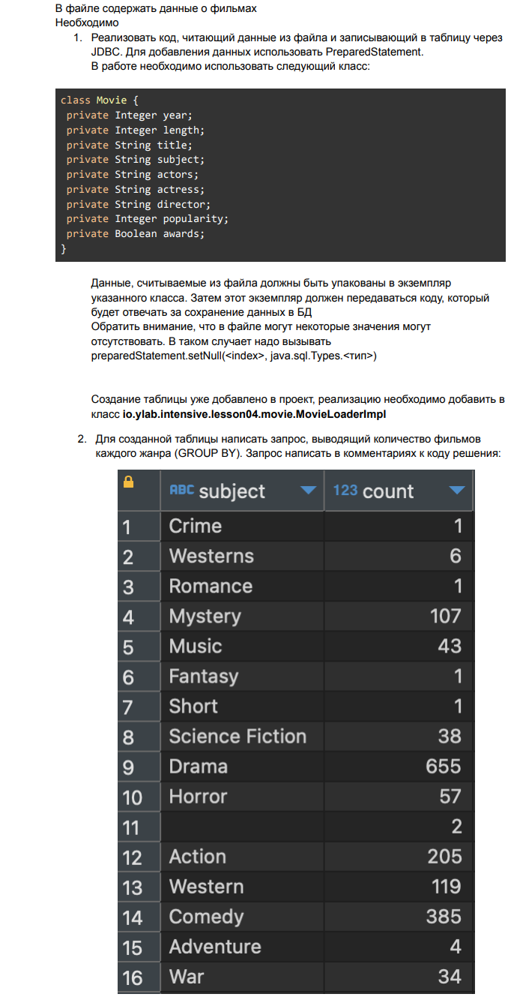

2. **[Persistent Map](./src/main/java/io/ylab/intensive/lesson04/persistentmap)**

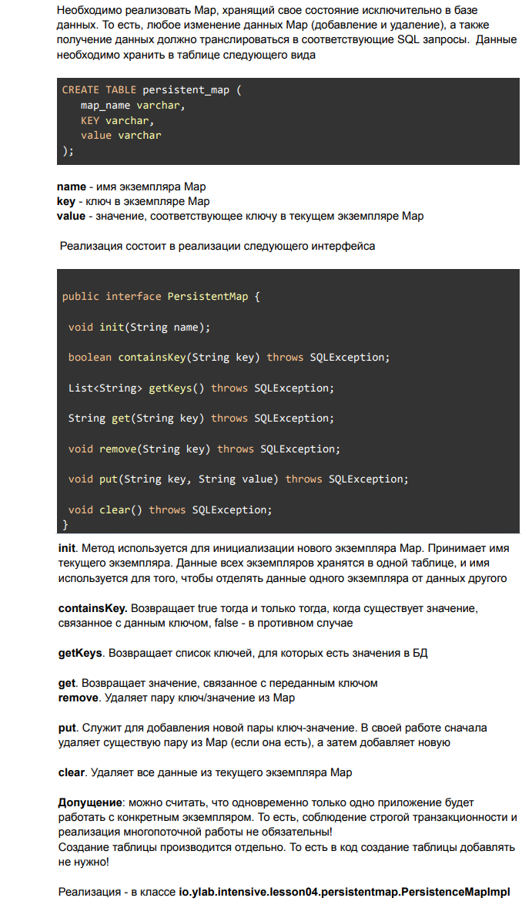

3. **[FileSort Returns](./src/main/java/io/ylab/intensive/lesson04/filesort)**

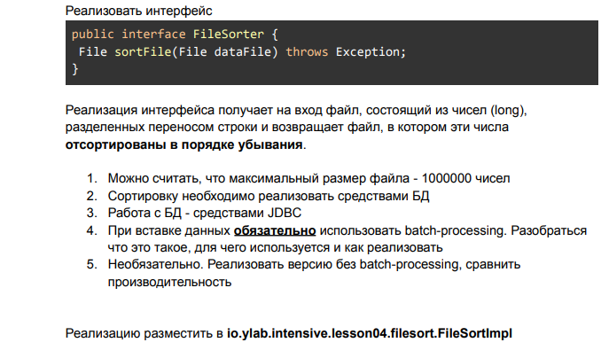

4. **[Event Sourcing](./src/main/java/io/ylab/intensive/lesson04/eventsourcing)**

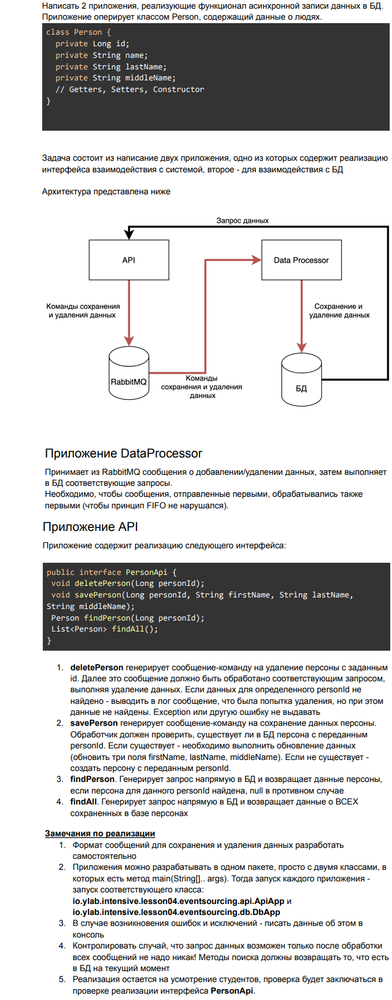

## Задания к занятию 05 (Основы Spring)
[Вернуться](#оглавление)

1. **[Event Sourcing](./src/main/java/io/ylab/intensive/lesson05/eventsourcing)**
   > Задача из предыдущего ДЗ. Должно быть реализована с разбиением на Spring
   компоненты, а потом запуском как spring приложения. В качестве кандидатов на
   оформление в виде компонентов - DataSource, ConnectionFactory, классы для отправки
   сообщений, классы для получения сообщений, работы с БД

2. **[Query Extender](./src/main/java/io/ylab/intensive/lesson05/sqlquerybuilder)**

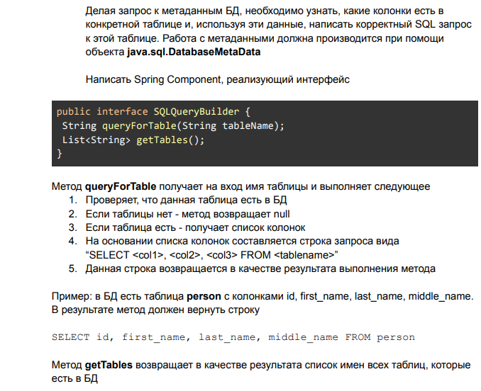

3. **[Message Filter (18+)](./src/main/java/io/ylab/intensive/lesson05/messagefilter)**

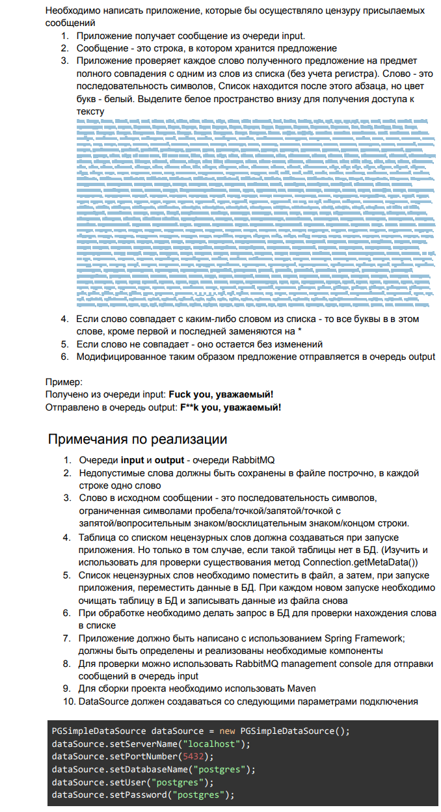
